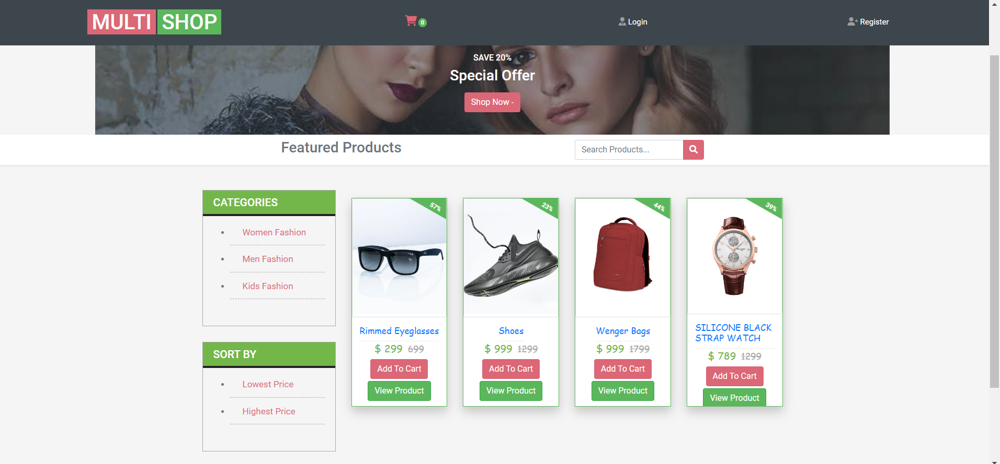

# MULTISHOP



MULTI SHOP is a Ecommerce web site you must have an account.
This project was created using Node.js, Express, MongoDB, and Bootstrap. JWT was used to handle authentication.

<br>


---

### Table of Contents

- [Description](#Description)
- [Demo](#demo)
- [Project Layout](#project-layout)
- [References](#references)
- [Author Info](#author-info)

---

## Description
<br>
This website is ecommerce.  I used HTML, CSS, ejs, MongoDB, jQuery, Javascript, Express, Node and NPM. This website is hosted using AWS.
<br>
<br>

### Live Demo - [MULTISHOP](https://shopping.dramalite.com/)


### Technologies

- Node.js
- Express 
- MongoDB
- Bootstrap
- JWT


---

## Demo
<br>
<p align="center">
   
</p>
<br>
<p align="center">
   
</p>
<br>
<p align="center">
   
</p>
<br>
<p align="center">
   
</p>


---


---

## Project Layout

```
MULTISHOP
├─ app.js
├─ multishop
├─ middleware
│  └─ index.js
├─ models
│  ├─ products.js
│  ├─ categories.js
│  ├─ order.js
│  ├─ cart.js
│  └─ user.js
├─ package-lock.json
├─ package.json
├─ Procfile
├─ public
│  └─ stylesheets
│     ├─ landing.css
│     └─ main.css
├─ README.md
├─ routes
│  ├─ cart.js
│  ├─ products.js
│  ├─ order.js
│  ├─ admin.js
│  └─ index.js
└─ views
  

```

## References

- [EJS](https://ejs.co/)
- [MongoDB](https://www.mongodb.com/)
- [JWT](https://jwt.io//)
- [Express](https://expressjs.com/)

---

## Author Info

- LinkedIn - [Harshid Basil](https://www.linkedin.com/harshidbasil)
- Github - [Basil](https://github.com/basildybala)

#### [Back To The Top](#MULTISHOP)

